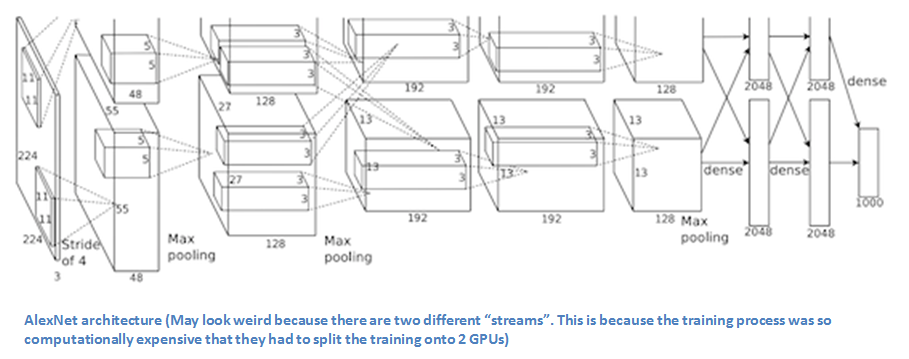

# AlexNet 
### A Convolutional Neural Network created by Alex Krizhevsky

```

```

## Notes :
 
  Dataset : 1.2 million high-res images from ImageNet LSVRC-2010 contest
  
  Number of Classes : 1000
  
  Error rates : top1 - 37.5% , top5 - 17.0%
  
  Trained on 2 GTX 580 GPU
  
  References :
  

 - https://www.cs.toronto.edu/~kriz/imagenet_classification_with_deep_convolutional.pdf
 - https://www.learnopencv.com/understanding-alexnet/

  ## Input :
  256x256 sized RGB image


  ## Architecture :
    60 million parameters
    
    6,50,000 neurons
    
    8 Learned Layers : 
    
    5 Convolutional Layers
    
    3 Fully Connected Layers
    
    1000-way softmax
  
  ## Activation function :
    ReLU (Rectified Linear Units) Non-linear as it trained faster than tanh units
  
      The activation function is responsible for transforming the summed weighted input from the node into the 
       activation of the node or output for that input
  
    ReLu Formula : F(x) = max(0.0,x)    
## Convolutional Layers :
 ### 1st Convolutional Layer :
  Kernels - 96 
  
  Size - 11x11x3
  
  Strides - 4
  
  Multiple Convolution kernels acts like a filter and extract features

  Followed by Response Normalization then Max Pooling

 ### 2nd Convolutional Layer :
  Kernals - 256
  
  Size - 5x5x48
  
  Stride - 1
  
  Response Normalization and Max Pooling
  
 ### 3rd Convolutional Layer :
  Kernels - 384
  
  Size - 3x3x256
  
  Stride - 1
  
 ### 4th Convolutional Layer :
 Kernels - 384
  
 Size - 3x3x192

 ### 5th Convolutional Layer :
 Kernels - 256
 
 Size - 3x3x192

## Fully  Connected Layer :
 Number of Neurons : 4096
 
